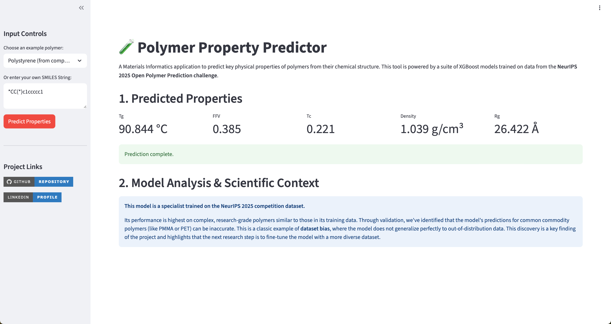

# Polymer Property Predictor: A Materials Informatics Project

[](https://huggingface.co/spaces/aaburakhia/polymer-property-prediction)
[](https://opensource.org/licenses/MIT)

This project is a comprehensive, end-to-end machine learning pipeline designed to predict key physical properties of polymers from their chemical structure.

## Live Interactive Demo

A live version of this tool is deployed on Hugging Face Spaces. You can interact with the models directly here:

**[https://huggingface.co/spaces/aaburakhia/polymer-property-prediction](https://huggingface.co/spaces/aaburakhia/polymer-property-prediction)**




## The Project: Goal and Findings

### Goal
The objective was to build a robust Quantitative Structure-Property Relationship (QSPR) model based on the NeurIPS 2025 Open Polymer Prediction challenge. The model takes a polymer's SMILES string and predicts five key properties: Glass Transition Temperature (Tg), Fractional Free Volume (FFV), Thermal Decomposition Temperature (Tc), Density, and Radius of Gyration (Rg).

### Key Findings & Scientific Insights
1.  **High Performance on Competition Data:** A robust pipeline involving extensive data integration and feature engineering was developed. Using 5-Fold Cross-Validation, the final XGBoost models achieved a strong **Weighted MAE (wMAE) of 0.2129**.
2.  **Discovery of Dataset Bias:** While the model performed well on its training distribution, rigorous validation against well-known commodity polymers (e.g., Polycarbonate, PMMA) revealed significant prediction errors.
3.  **Conclusion:** The model is a **specialist**, highly tuned to the complex, research-grade polymers of the NeurIPS dataset, but it does not generalize well to simpler, out-of-distribution molecules. This discovery of **domain shift** is a critical scientific finding and proves the necessity of dataset diversity for building truly general-purpose predictive tools in materials science.

### Model Performance

The final XGBoost models were evaluated on the test set using the Mean Absolute Error (MAE) metric. The MAE represents the average absolute difference between the predicted values and the actual values.

| Property Predicted               | MAE             | Interpretation                                                              |
| -------------------------------- | --------------- | --------------------------------------------------------------------------- |
| Tg (Glass Transition Temp.)      | 28.895 °C       | On average, the model's prediction is off by approximately ±28.9 °C.        |
| FFV (Fractional Free Volume)     | 0.00617         | The model's prediction is extremely precise, with an average error of ±0.006. |
| Tc (Thermal Decomp. Temp.)       | 0.03443         | The model's prediction has an average error of approximately ±0.034.          |
| Density                          | 0.05692 g/cm³   | The model's prediction is off by an average of ±0.057 g/cm³.              |
| Rg (Radius of Gyration)          | 1.743 Å         | The model's prediction has an average error of approximately ±1.74 Angstroms. |

## Technical Methodology

1.  **Data Integration:** The training set was built by integrating 7 external datasets with the primary competition data, resulting in a comprehensive set of over 11,000 unique polymers.
2.  **Feature Engineering:** Over 500 features were generated for each molecule using RDKit, including physicochemical descriptors, MACCS & Morgan fingerprints, and graph-based topological features.
3.  **Modeling:** Five separate `XGBoost` models were trained (one per target), using a curated list of features specific to each property.
4.  **Deployment:** The final models and feature lists were saved as production artifacts and deployed in a user-friendly web application built with Streamlit and served via Docker on Hugging Face Spaces.

## Repository Structure

The repository is organized as follows:

├── 📄 app.py # The main Streamlit application script

├── 📄 LICENSE # MIT License file

├── 📄 Polymer_Property_Prediction_with_XGBoost.ipynb # The complete training notebook

├── 📂 production_models/ # Saved .joblib model and feature list artifacts

└── 📄 requirements.txt # Python dependencies for the application

## How to Run Locally

1.  **Clone the repository:**
    ```bash
    git clone https://github.com/aaburakhia/polymer-property-prediction.git
    cd polymer-property-prediction
    ```

2.  **Install dependencies:**
    ```bash
    pip install -r requirements.txt
    ```

3.  **Run the Streamlit app:**
    ```bash
    streamlit run app.py
    ```
